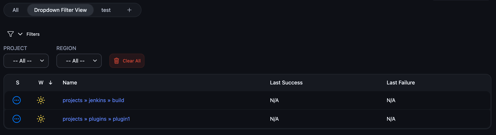
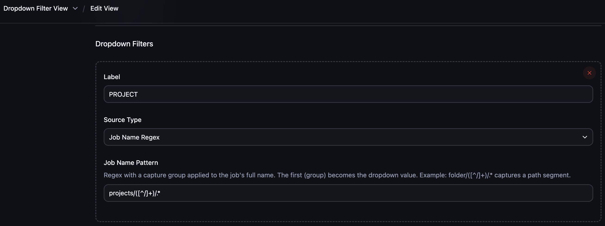
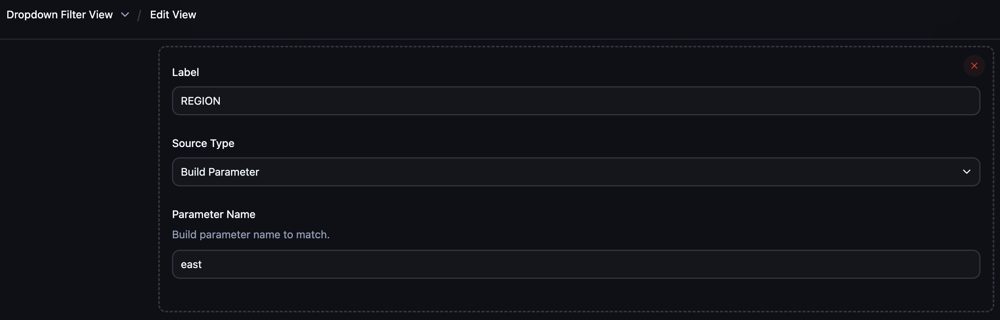
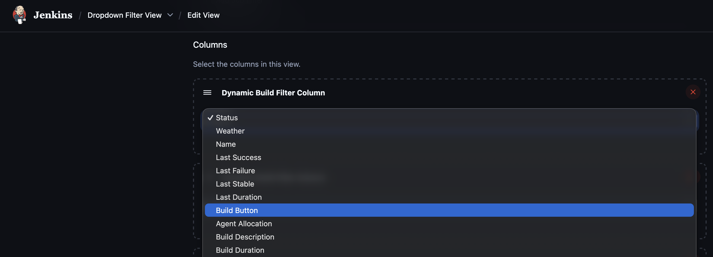
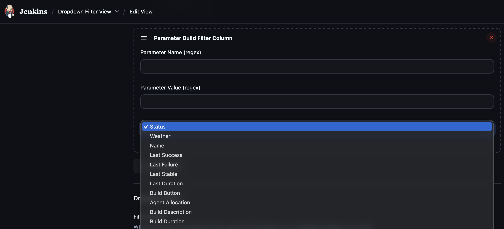
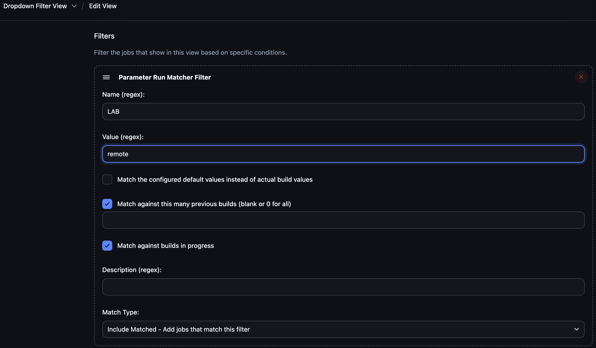

# Dynamic View Filter Plugin

[](https://ci.jenkins.io/job/Plugins/job/dynamic-view-filter-plugin/job/main/)
[](https://plugins.jenkins.io/dynamic-view-filter)

Dynamic view filters with auto-populated dropdown menus, build filter columns, and parameter-based run matching for Jenkins.

## What does this plugin do?

Imagine you have hundreds of Jenkins jobs organized in folders — different projects, platforms, and environments. Normally you'd scroll through all of them or create dozens of separate views manually.

This plugin lets you:

- **Add dropdown menus at the top of any view** that automatically populate with values extracted from your job names or build parameters. Select "production" from an environment dropdown and instantly see only production jobs.
- **Show only relevant build results in columns.** If you filter by a parameter (e.g., `region=east`), the Status, Last Success, and Last Failure columns update to reflect only matching builds — not just the latest build regardless.
- **Works with all job types.** The upstream `BuildFilterColumn` from View Job Filters can break with Pipeline (Jenkinsfile) jobs. This plugin handles Pipeline, FreeStyle, Matrix, and any other job type reliably.

In short: **dynamic dropdowns that filter both your job list and the build data shown in columns, with zero manual maintenance.**

## Screenshots

### Dropdown Filter View

Auto-populated dropdown menus at the top of the view for filtering jobs instantly.



### Dropdown Filter Configuration

#### Job Name Regex Source

Extract dropdown values from job folder paths using a regex capture group.



#### Build Parameter Source

Populate dropdown values from actual build parameter values.



### Dynamic Build Filter Column

Wraps a standard column (Status, Weather, etc.) and filters build data through the view's job filters.



### Parameter Build Filter Column

Self-contained column that filters builds by parameter name and value regex, with delegate column selection.



### Parameter Run Matcher Filter

View-level job filter for matching builds by parameter name, value, and description regex.



## Background

The [View Job Filters](https://plugins.jenkins.io/view-job-filters/) plugin provides `BuildFilterColumn` for filtering build data in list view columns. However, it relies on stored XStream back-references and runtime proxying that can break with Pipeline jobs and Job DSL configurations.

This plugin provides robust alternatives that:

- Resolve the parent view at render time from the Stapler request context (no stored back-references)
- Filter at the generic `Job`/`Run` API layer (works with any job type)
- Add parameter-based filtering at both the column and view level
- Provide a configurable **Dropdown Filter View** with auto-populated dropdown menus

## Features

### 1. Dropdown Filter View

A custom view type that extends ListView with configurable dropdown filters at the top. Dropdowns auto-populate their options from the jobs in the view.

Two source types:

| Source Type | How it works |
|---|---|
| **Job Name Regex** | Applies a regex with a capture group to job full names. E.g., `projects/([^/]+)/.*` extracts the project name from folder paths. |
| **Build Parameter** | Scans actual build runs to collect distinct values of a named parameter. Filters both which jobs appear and which builds are shown in columns. |

Multiple dropdowns combine with AND logic. All standard ListView features (columns, job filters, regex include) are preserved.

> **Important:** The Dropdown Filter View is a ListView — it only sees jobs that match the view's **Include jobs by regex** field. You must configure a regex pattern (e.g., `.*`) and enable **Recurse in subfolders** in the view configuration for the dropdowns to discover and filter jobs. The dropdown regex/parameter filters narrow down from this base set.

### 2. Dynamic Build Filter Column

A drop-in replacement for `BuildFilterColumn`. Wraps any standard column (Status, Weather, Last Success, Last Failure, etc.) and filters the build data through the view's `RunMatcher` job filters before the delegate renders.

### 3. Parameter Build Filter Column

A self-contained column that filters builds by parameter name and value regex. No separate view-level filter required — configure the parameter matching directly on the column itself.

### 4. Parameter Run Matcher Filter

A view-level job filter implementing `RunMatcher`. Add it once to a view's Job Filters section and every `DynamicBuildFilterColumn` in that view will filter builds through it.

Supports:
- Name regex, value regex, description regex
- Default value vs. actual build value matching
- Multi-build scanning with configurable limits
- In-progress build matching
- Include/exclude modes (4 combinations)

## Usage

### UI Configuration

1. Create a new view and select **Dropdown Filter View** (or use a standard **List View**)
2. Add **Dynamic Build Filter Column** wrapping your desired columns (Status, Last Success, etc.)
3. Optionally add **Parameter Run Matcher Filter** to the Job Filters section
4. For Dropdown Filter View, add dropdowns with regex patterns or parameter names

### XML / Job DSL Examples

**Dynamic Build Filter Column** — wraps a delegate column with view-level RunMatcher filtering:

```xml
<columns>
  <io.jenkins.plugins.dynamic_view_filter.DynamicBuildFilterColumn>
    <delegate class="hudson.views.StatusColumn"/>
  </io.jenkins.plugins.dynamic_view_filter.DynamicBuildFilterColumn>
</columns>
```

**Parameter Build Filter Column** — self-contained per-column parameter filtering:

```xml
<columns>
  <io.jenkins.plugins.dynamic_view_filter.ParameterBuildFilterColumn>
    <delegate class="hudson.views.LastSuccessColumn"/>
    <paramName>region</paramName>
    <paramValueRegex>east</paramValueRegex>
  </io.jenkins.plugins.dynamic_view_filter.ParameterBuildFilterColumn>
</columns>
```

**Dropdown Filter View** — view with auto-populated dropdown filters:

```xml
<io.jenkins.plugins.dynamic_view_filter.DropdownFilterView>
  <name>My Filtered View</name>
  <includeRegex>projects/.*/.*</includeRegex>
  <recurse>true</recurse>
  <dropdowns>
    <io.jenkins.plugins.dynamic_view_filter.DropdownDefinition>
      <label>Project</label>
      <sourceType>jobNameRegex</sourceType>
      <jobNamePattern>projects/([^/]+)/.*</jobNamePattern>
      <parameterName/>
    </io.jenkins.plugins.dynamic_view_filter.DropdownDefinition>
    <io.jenkins.plugins.dynamic_view_filter.DropdownDefinition>
      <label>Environment</label>
      <sourceType>buildParameter</sourceType>
      <jobNamePattern/>
      <parameterName>env</parameterName>
    </io.jenkins.plugins.dynamic_view_filter.DropdownDefinition>
  </dropdowns>
</io.jenkins.plugins.dynamic_view_filter.DropdownFilterView>
```

## Troubleshooting

### Columns show N/A even though jobs have been built

`DynamicBuildFilterColumn` filters build data through **all** `RunMatcher` filters configured on the view — not just dropdown selections. If you have a `Parameter Run Matcher Filter` in the view's **Filters** section (e.g., `LAB=remote`), every build that doesn't match that filter will be excluded, and the columns will show N/A.

**To diagnose:**
1. Go to **Edit View** → **Job Filters** section
2. Check if any `Parameter Run Matcher Filter` is configured with restrictive criteria
3. If the jobs don't have matching parameter values, all builds get filtered out

**To fix:**
- Remove or adjust the `Parameter Run Matcher Filter` if it's too restrictive
- Or use `Parameter Build Filter Column` instead — it applies its own filter independently without requiring a view-level filter

> **Tip:** `DynamicBuildFilterColumn` + `Parameter Run Matcher Filter` is a global approach (affects all wrapped columns). `Parameter Build Filter Column` is a per-column approach (each column filters independently). Choose based on whether you want uniform or independent filtering.

## Requirements

- Jenkins 2.528.3 or newer
- [View Job Filters](https://plugins.jenkins.io/view-job-filters/) plugin

## Usage Scenarios

See [docs/USAGE_SCENARIOS.md](docs/USAGE_SCENARIOS.md) for detailed walkthroughs covering common setups like multi-environment dashboards, dropdown-driven project views, Pipeline job filtering, and more.

## Changelog

See [GitHub Releases](https://github.com/jenkinsci/dynamic-view-filter-plugin/releases) for the changelog.

## Contributing

Refer to [CONTRIBUTING.md](CONTRIBUTING.md) for development setup, build commands, and pull request guidelines. For build details, see [docs/BUILD.md](docs/BUILD.md).

## License

Licensed under the [MIT License](LICENSE).
