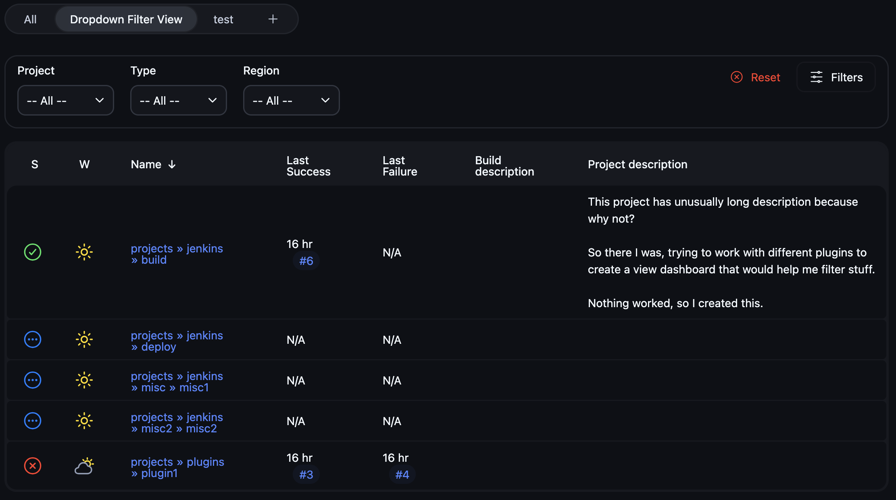
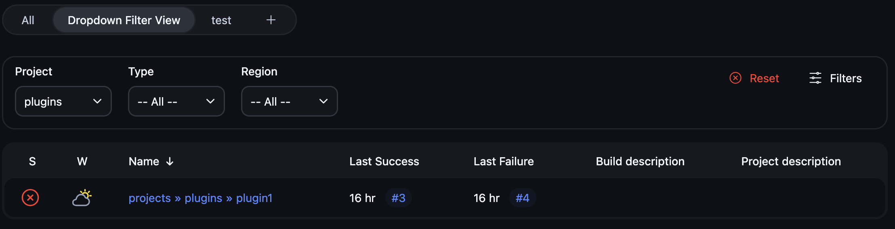
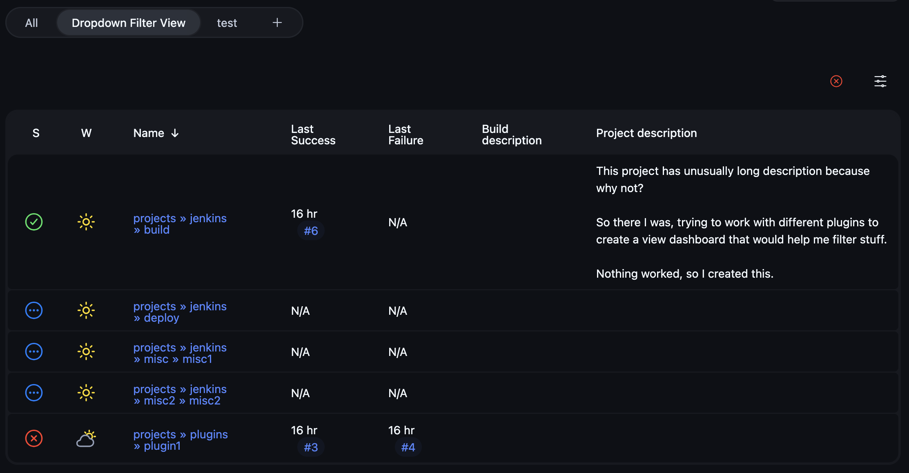
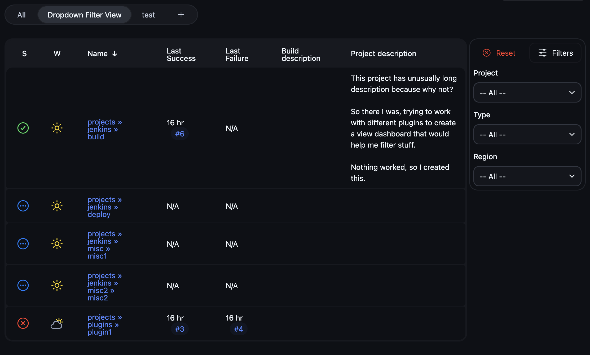
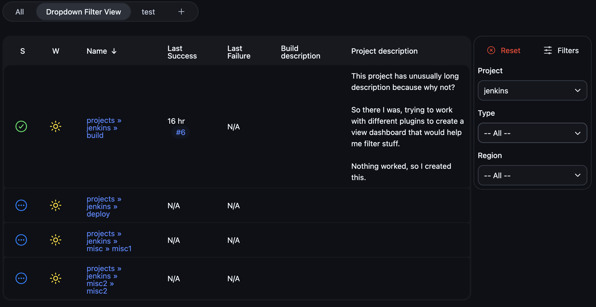
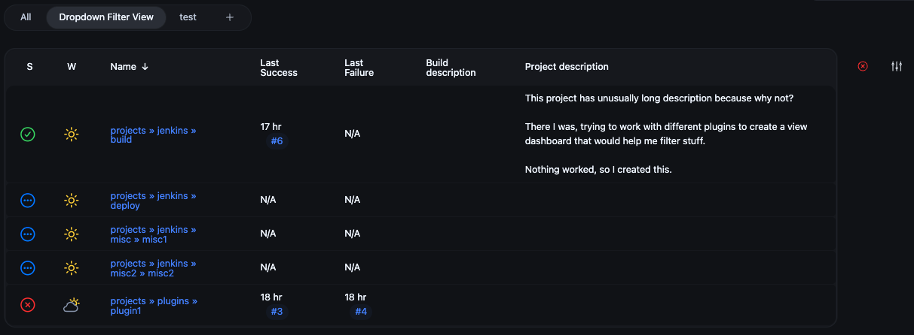
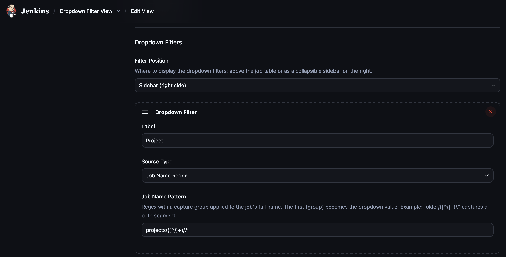
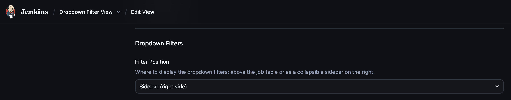
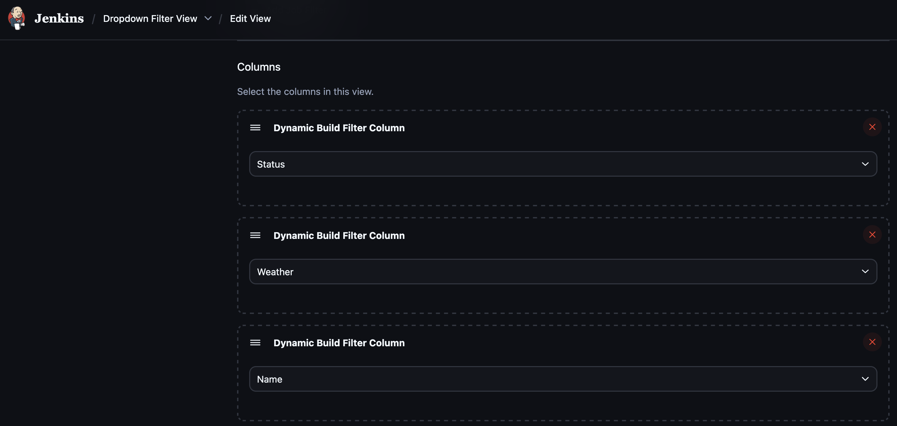
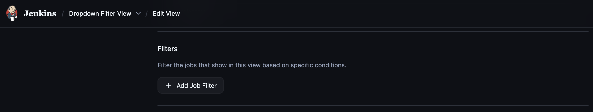

# Screenshots

## Dropdown Filter View — Top Mode

Filter bar at the top with horizontally arranged dropdowns, Reset button, and Filters toggle.

With a filter applied (Project = `plugins`), only matching jobs are shown:

Collapsed state, only the toggle icon remains:

## Dropdown Filter View — Sidebar Mode

Filter bar as a sidebar on the right with vertically stacked dropdowns.

With a filter applied (Project = `jenkins`), only matching jobs are shown:

Collapsed state, sidebar collapses to a compact icon strip:

## Configuration

### Dropdown Filters

Add dropdown definitions with Job Name Regex or Build Parameter source types.

### Filter Position

Choose where the filter bar appears: top or sidebar.

### Job Name Regex Source

Extract dropdown values from job folder paths using a regex capture group.

### Build Parameter Source

Populate dropdown values from actual build parameter values.

### Columns

Configure Dynamic Build Filter Column and Parameter Build Filter Column.

### Job Filters

Add Parameter Run Matcher Filter to the Job Filters section.

## Column and Filter Types

### Dynamic Build Filter Column

Wraps a standard column (Status, Weather, etc.) and filters build data through the view's job filters.

### Parameter Build Filter Column

Self-contained column that filters builds by parameter name and value regex, with delegate column selection.

### Parameter Run Matcher Filter

View-level job filter for matching builds by parameter name, value, and description regex.

